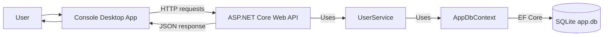
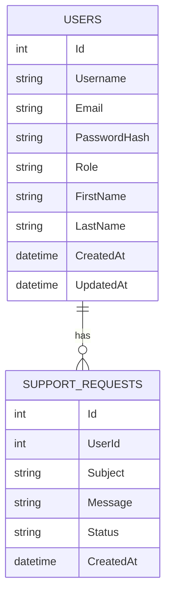

# UserManagementApp

UserManagementApp is a learning project built with C# and .NET.  
The main idea is to create a desktop application that works with users through a backend Web API.

At the current stage, the desktop app is a simple Console App. Later it can be replaced or upgraded to a WPF UI.

## Project Goal

The application should support:

- Users management
- Admin and Regular User roles
- Support requests
- Web API endpoints
- SQLite database
- Swagger documentation
- Automated tests

The desktop application should not access the database directly.  
All operations should go through the API.

## Current Project Structure

```text
UserManagementApp/
│
├── UserManagementApp.Desktop/
│   └── Console app now, WPF later
│
├── UserManagementApp.Api/
│   └── ASP.NET Core Web API, Swagger, Controllers
│
├── UserManagementApp.Core/
│   └── Models, DTOs, Interfaces, Enums
│
├── UserManagementApp.Data/
│   └── EF Core, SQLite, AppDbContext, Services, Migrations
│
└── UserManagementApp.Tests.Unit/
    └── xUnit unit tests
```

## Runtime Flow



## Database Relationship



## Technologies

- C#
- .NET
- ASP.NET Core Web API
- Entity Framework Core
- SQLite
- Swagger / OpenAPI
- xUnit
- JetBrains Rider

## Current Features

Implemented so far:

- [x] Solution structure
- [x] ASP.NET Core Web API project
- [x] Core project with models, enums, DTOs and interfaces
- [x] Data project with EF Core and SQLite
- [x] AppDbContext
- [x] Database migrations
- [x] Database health endpoint
- [x] Users API endpoints
- [x] UserService
- [x] DTO-based API requests and responses

## Current API Endpoints

### Database

```http
GET /api/database/status
```

Checks if the API can connect to the SQLite database.

### Users

```http
GET    /api/users
GET    /api/users/{id}
POST   /api/users
PUT    /api/users/{id}
DELETE /api/users/{id}
```

The Users API supports basic CRUD operations.

Current user API uses DTOs:

- `CreateUserRequest` for creating users
- `UpdateUserRequest` for updating users
- `UserResponse` for returning user data