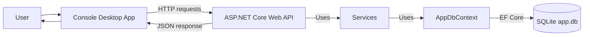
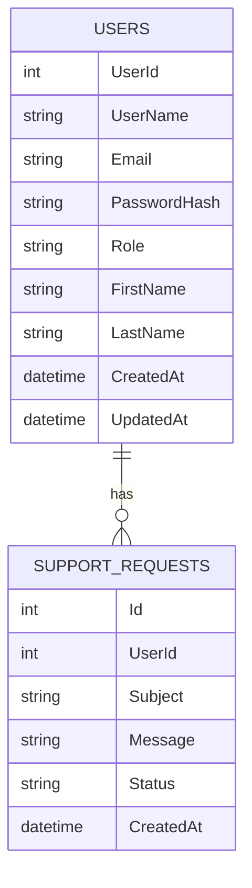

# UserManagementApp
UserManagementApp is a learning project built with C# and .NET.

The main idea is to create a desktop application that works with users through a backend Web API.  
The desktop app does not access the database directly. All operations go through API endpoints.

At the current stage, the desktop app is implemented as a Console App. Later it can be upgraded to WPF UI.

## Project Goal

The application is planned to support:

- User management
- Admin and Regular User roles
- Authentication flow
- Role-based permissions
- Support requests
- Web API endpoints
- SQLite database
- Swagger documentation
- Automated tests


## Current Project Structure

```text
UserManagementApp/
│
├── UserManagementApp.Desktop/
│   └── Console client, API clients, console menu
│
├── UserManagementApp.Api/
│   └── ASP.NET Core Web API, Swagger, Controllers
│
├── UserManagementApp.Core/
│   └── Models, DTOs, Interfaces, Enums
│
├── UserManagementApp.Data/
│   └── EF Core, SQLite, AppDbContext, Services, Migrations
│
└── UserManagementApp.Tests.Unit/
    └── NUnit unit tests
```

## Runtime Flow



## Database Relationship



## Technologies

- C#
- .NET
- ASP.NET Core Web API
- Entity Framework Core
- SQLite
- Swagger / OpenAPI
- xUnit
- JetBrains Rider

## Current Features

Implemented so far:

| Area        | Feature                                               |
|-------------|-------------------------------------------------------|
| Solution    | Basic solution structure                              |
| API         | ASP.NET Core Web API project                          |
| Desktop     | Console Desktop project                               |
| Core        | Models, enums, DTOs and interfaces                    |
| Data        | EF Core, SQLite, `AppDbContext` and migrations        |
| Database    | SQLite database with Users and SupportRequests tables |
| API         | Database health endpoint                              |
| API         | Users CRUD endpoints                                  |
| API         | DTO-based requests and responses                      |
| Services    | `UserService`                                         |
| Auth        | Basic login endpoint                                  |
| Permissions | Basic role/permission flow                            |
| Desktop     | Configuration via `appsettings.json`                  |
| Desktop     | API clients for communication with backend            |
| Desktop     | Console menu                                          |
| Tests       | Unit tests for `UserService`                          |

## Current API Endpoints

### Database

```http
GET /api/database/status
```

Checks if the API can connect to the SQLite database.

### Auth

```http
POST /api/auth/login
```

Used to log in with userName and password.

### Users

```http
GET    /api/users
GET    /api/users/{id}
POST   /api/users
PUT    /api/users/{id}
DELETE /api/users/{id}
```

The Users API supports basic CRUD operations.

Current user API uses DTOs:

- `CreateUserRequest` for creating users
- `UpdateUserRequest` for updating users
- `UserResponse` for returning user data

## Console App

The console desktop client currently supports:
- [x] Login
- [x] Role-based menu
- [x] Show users
- [x] Create user
- [x] Update user
- [x] Delete user
- [x] Logout

 Admin users can manage users. 
 Regular users have limited access.
 
### Desktop Configuration
The desktop app uses `appsettings.json` for API configuration:
```json
{
  "ApiSettings": {
    "BaseUrl": "http://localhost:5236"
  }
}
```

## Testing

The project has one test project:

```text
UserManagementApp.Tests
```

Test structure:

```text
UserManagementApp.Tests/
│
├── UnitTests/
│   └── Service-level tests
│
├── ApiTests/
│   └── HTTP API tests
│
├── IntegrationTests/
│   └── Database / EF Core tests
│
└── Core/
    ├── Clients/
    ├── Configuration/
    ├── Helpers/
    └── Logging/
```

Current test coverage includes:

- `UserServiceTests`
- `AuthServiceTests`
- `DatabaseTests`
- `AuthApiTests`
- `UsersApiTests`
- `AppDbContextTests`

API tests use:

- shared API clients
- `TestDataHelper`
- `TestCaseStep` logging
- automatic cleanup for temporary users

---

## Local Setup

### 1. Clone repository

```bash
git clone <repository-url>
cd UserManagementApp
```

### 2. Restore packages

```bash
dotnet restore
```

### 3. Apply database migrations

```bash
dotnet ef database update --project UserManagementApp.Data --startup-project UserManagementApp.Api --context AppDbContext
```

This will create the local SQLite database file:

```text
UserManagementApp.Api/app.db
```

---

## Local Configuration

### API

The API uses `appsettings.json` inside:

```text
UserManagementApp.Api/appsettings.json
```

Example:

```json
{
  "ConnectionStrings": {
    "DefaultConnection": "Data Source=app.db"
  }
}
```

### Desktop Console App

The desktop app uses:

```text
UserManagementApp.Desktop/appsettings.json
```

Example:

```json
{
  "ApiSettings": {
    "BaseUrl": "http://localhost:5236"
  }
}
```

Update `BaseUrl` if your API runs on another port.

### Tests

The test project uses:

```text
UserManagementApp.Tests/appsettings.json
```

Example:

```json
{
  "ApiSettings": {
    "BaseUrl": "http://localhost:5236"
  },

  "DatabaseSettings": {
    "ConnectionString": "../../../../UserManagementApp.Api/app.db"
  }
}
```

Update the `DatabaseSettings:ConnectionString` to point to your local `app.db`.

---

## How to Run

### Run API

```bash
dotnet run --project UserManagementApp.Api
```

Swagger should be available at:

```text
http://localhost:5236/swagger
```

### Run Console App

```bash
dotnet run --project UserManagementApp.Desktop
```

### Run Tests

```bash
dotnet test
```

Or run only the test project:

```bash
dotnet test UserManagementApp.Tests/UserManagementApp.Tests.csproj
```

Important:

- Unit tests do not require the API to be running.
- Integration tests use SQLite in-memory or database-level checks.
- API tests require `UserManagementApp.Api` to be running.

---

## Notes

This project is still in progress.

Planned future improvements:

- More API test coverage
- Better error handling
- Improved role/permission system
- Logging improvements
- WPF UI
